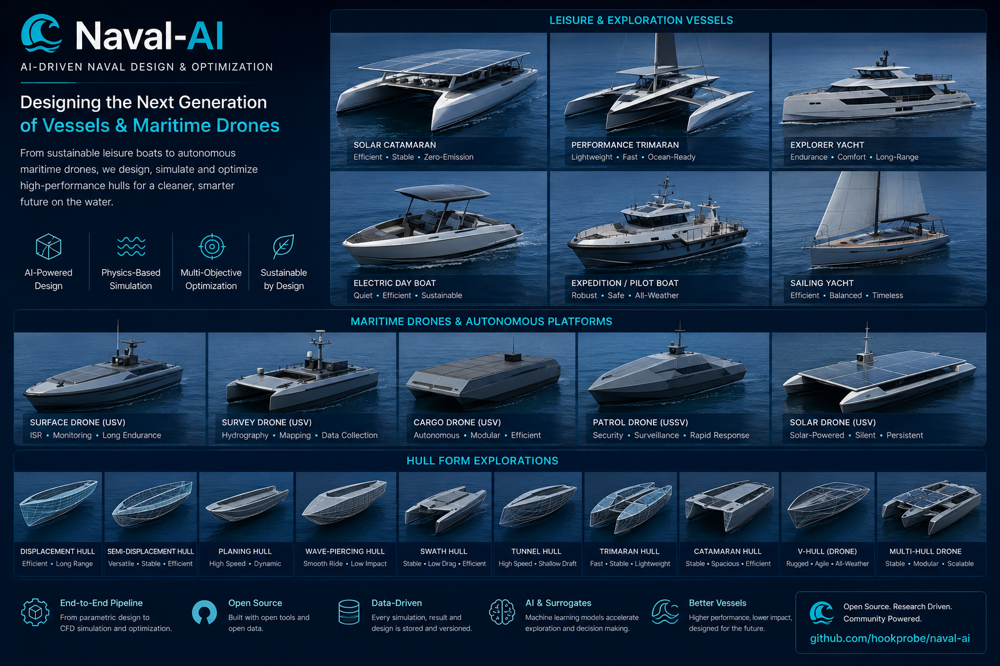

# NavalAI

<p align="center">
  
</p>

> **NavalAI generates the safest, most energy-efficient, BUILDABLE vessel for a
> specified mission and budget — and shows its evidence.**
>
> — `PLM.md` §0, which is the home of the vision, the two product families and
> the gap analysis. This blockquote is a citation, not a second copy.

**The gap is not that the industry lacks tools.** CAD systems, hydrostatic
packages, RANS solvers and open-source naval-architecture calculators all exist,
and several of them are excellent. The gap is that there is **no broadly
accessible, integrated, physics-aware workflow in which a technically capable
person can state a MISSION and get back a safe, efficient, structurally
realisable vessel with a traceable evidence trail.** Today that path is

    CAD → hydrostatics → resistance → CFD → manual stability
        → manual structure → manual electrical → manual drawings

— eight tools, every arrow a hand-carried file and a re-keyed number. NavalAI
collapses it into one governed pipeline, and the governing is the product:
every quantity carries `{value, tier, sigma}`, the ladder refuses what it cannot
compute in-process instead of substituting something cheaper, and a gate that
misses its bar stays red, on the record, with an owner and a review date.

Two product families share nearly the whole engine and differ mainly in the
mission layer — **recreational / DIY** (people, range, speed, comfort, cost,
coastal conditions) and the **autonomous marine drone** (payload, endurance, sea
state, sensor package). The drone family is DECLARED, not built; `PLM.md` §2.0
says exactly what is missing and why it is the mission layer rather than the
physics.

<p align="center">
  
</p>

**What the picture is, and is not.** These renders are the project's **visual
vocabulary** — the vessel families and hull forms the two product lines aim at,
from the solar catamaran and electric day boat through the survey and solar
USVs, down to the ten hull-form families along the bottom row. They are
REFERENCE IMAGERY, not generator output: in this project a rendered image never
defines Cp, LCB, displacement, stability or resistance — geometry comes from
the mathematical kernel and every claim above carries its evidence. (Of the ten
hull forms pictured, the grammar today expresses the chined families and the
round bilge; multi-chine and SWATH are on the roadmap — `docs/BUILD-PLAN.md`
§16 phase PV.)

Licensed under **GNU AGPL-3.0** (see `LICENSE`).

## Quickstart

```bash
python3 -m venv .venv && source .venv/bin/activate
pip install -r requirements.txt              # pinned, lower and upper bounds
pip install -r requirements-optional.txt     # capytaine/cadquery/mujoco tiers

python3 -m navalai.gates                     # what is proven, and what is not
python3 ui/server.py                         # slider surface -> localhost:8642
python3 benchmarks/wigley.py                 # the Michell Wigley curve
python3 -m pytest tests/ -q                  # the whole ladder (~10 min)
```

`python3 -m navalai.gates` is the honest status of the project and the only one
— no document in this tree carries a gate verdict. `python3 scripts/reconcile_gaps.py`
does the same for outstanding work.

## Where to start reading

| You want | Read |
|---|---|
| what this is for, what a product may be, who owns what | `PLM.md` |
| how the system is built, and what order it is being built in | `docs/BUILD-PLAN.md` |
| what has been MEASURED, and what was refuted | `docs/research/*.md` |
| what this project learned the hard way | `docs/LESSONS.md` |
| how to work in this repository | `CLAUDE.md` |
| what a production vessel needs beyond a hull | `docs/research/PRODUCTION.md` |

## The ladder

| Tier | What | Speed | Module |
|---|---|---|---|
| L0 | algebraic feasibility (closed-form checks) | ~0.05 ms | `grammar.py` |
| L1 | hydrostatics · Michell+ITTC57 · Holtrop-Mennen · energy/weight budget | ~20 ms | `hydrostatics.py` `resistance.py` `holtrop.py` `energy.py` |
| L2 | Capytaine BEM seakeeping (convergence-swept) | ~s–min | `seakeeping.py` |
| L3 | OpenFOAM interFoam resistance (runs on the Mac node) | hrs | `cfd/` |
| R | ISO 12217 / 12215-5 subsets (assessment aid) | ~ms | `rules/` |

The L0 count is deliberately not quoted here. The audit measured 9 live
constraints against a "49" the plan claimed and a "30+" this file claimed
(gap E4) — a count in prose is a count that drifts, so ask `grammar.check`.

L3 is the one tier that cannot run in-process: `evaluate` raises
`TierRequiresOperator` and names the operator route rather than quietly handing
back an L1 number wearing an L3 badge.

Surrogate spine (`surrogate.py`): ARD kriging + Kennedy–O'Hagan co-kriging,
batched-EI infill, OOD → ladder escalation. Generative (`generative.py`):
GMM family model + performance-conditioned sampling + 2-D latent map (guided
tabular diffusion is the planned drop-in upgrade behind the same interface).

## What the kernel does — each line checked against the code, 2026-08-13

This section states only what was re-verified by reading the module named
beside it. This project's recurring defect is a claim that is not true of the
code — four documents once asserted that two shipping subsystems did not exist —
so nothing goes here on the strength of having been written before.

- **The sectional-area curve and the design waterline are DESIGN CURVES, not
  outputs.** `geometry.sectional_area(params, x)` and
  `geometry.design_waterline(params, x)` are closed form. `Cp` and `lcb` are
  GENES in `grammar.PARAMS`, and `geometry.sac_exponents` SOLVES the area-curve
  exponents to deliver the requested pair, refusing a `(Cp, lcb)` it cannot
  reach at that `x_mb` instead of silently landing somewhere else. A naval
  architect chooses Cp for the design Froude number; here that is an input.
- **The section kernel is not three points.** `Hull.section_control()` returns
  the exact five-point description — two legs and ONE quadratic Bézier arc —
  and `immersed_section` integrates it in closed form. `Hull.section()` is
  adaptive: 3 points at `roundness == 0` (bit-for-bit the old polyline, fenced
  at 1e-12) and 257 above it.
- **Resistance knows where it stops being valid.** `resistance.FN_MICHELL_MAX`
  is **0.45**; past it the result is badged `L1-INVALID`, and
  `evaluate.tier_rank` puts that at **−1**, BELOW L0's 0 — so an
  out-of-envelope number can never win a comparison against a valid one.
- **The genome is SIXTEEN parameters** (`grammar.N_PARAMS`), not fifteen.
- **The optimiser minimises energy per mile, not drag.** `optimize.HullProblem`
  returns `(wh_per_nm, build panel area, distance from the GM band)` — build
  area is in the objective vector, so panel cost is optimised against, not
  checked afterwards.

## Honesty rules (enforced by tests, not vibes)

1. every quantity carries `{value, tier, sigma}` — no bare numbers
2. any kept design re-validates up the ladder; surrogates refuse OOD queries
3. the LLM translates missions and explains — it has **no code path to geometry**
4. retrained surrogates that degrade the frozen benchmark **never deploy**
5. rules output leads with `ASSESSMENT AID — NOT CERTIFICATION` and declares
   every approx-basis threshold
6. **never soften a failing gate threshold to make it pass** — a failing gate
   is information. RED gates are recorded in `data/gate-ledger.json` with a
   measured watermark, an owner and a review-by date, never reworded

## Gate registry

This table is GENERATED. It used to be hand-maintained, and every number in it
drifted: the per-gate test counts were stale throughout (Gate 1 read 13 against
22 actual), Gate 2U — a RED gate — had no row at all, and the Gate 2M row
carried a figure three later commits had superseded. Regenerate with
`python -m navalai.gates --readme --write`; a test fails if you do not.

<!-- BEGIN GATE TABLE — generated by `python -m navalai.gates --readme` -->

Run `python -m navalai.gates` for live status; this table is the
REGISTRY (what is gated by what), regenerated from `navalai/gates.py`.
A RED row's measured watermark, owner and review-by date live in
`data/gate-ledger.json` — never in prose here, which is how five
different Gate 2M numbers came to circulate at once (gap J1).

| Gate | Scope | Verified by |
|---|---|---|
| Gate 0G | the ladder cannot be talked into passing | `tests/test_gate_integrity.py` (38 tests) |
| Gate 0R | a missed clause is RED BY RECORD, never prose in a scope | `tests/test_red_by_record.py` (14 tests) |
| Gate 0K | geometry kernel: SAC/DWL design curves + N-point section | `tests/test_geometry_kernel.py` (19 tests) |
| Gate 1E | the stages agree with each other: one geometry, one resistance, one ply, tier+sigma across every handoff | `tests/test_end_to_end_flow.py` (14 tests) |
| Gate 0F | the hull-form library: bands ordered, every band carries its basis, no family contradicts its own Froude regime | `tests/test_formlib.py` (49 tests) |
| Gate 0X | the experiment suite: controlled sweeps hold their controlled quantities, out-of-envelope points are refused, and the Michell interference phase matches an independent superposition | `tests/test_experiments.py` (52 tests) |
| Gate 1M | the vessel: topology/manning/regime, the parallel-axis I_T, separation in the PRODUCTION wave term, and no multihull safety verdict from a monohull GM floor | `tests/test_multihull.py` (31 tests) |
| Gate PV-B | vessel-conditional proportion bands, the sourced size box, and the multihull stability refusal | `tests/test_vessel_bands.py` (19 tests) |
| Gate 0B | buildability metrics are PROXIES that refuse rather than default, are grid-converged by a measured residual, and price manufacturing in ABSOLUTE m^2 — never in a ratio an optimiser can inflate | `tests/test_buildability.py` (11 tests) |
| Gate 0 | grammar/geometry/DB | `tests/test_phase0.py` (15 tests) |
| Gate 1 | L1 physics + Wigley anchor + <50ms | `tests/test_phase1.py` (35 tests) |
| Gate 1H | Holtrop-Mennen vs the 1982 worked example | `tests/test_holtrop.py` (57 tests) |
| Gate 1C | the constraint vector: complete, ordered, finite, and no undefined state reported as ideal | `tests/test_constraints_honest.py` (19 tests) |
| Gate 1P | the L1 physics core says what it actually computed | `tests/test_gapfix_physics.py` (26 tests) |
| Gate 1b | NSGA-II Pareto front | `tests/test_optimize.py` (11 tests) |
| Gate 2 | Capytaine BEM (Hulme anchor) | `tests/test_phase2.py` (18 tests) |
| Gate 2R | CFD reference parity + GCI honesty | `tests/test_cfd_reference_parity.py` (100 tests) |
| Gate 2P | slamming pressure is measurable: a bow patch that partitions the hull, a function object that refuses to point at nothing, and a Wagner C_p guarded at both limits | `tests/test_slamming.py` (14 tests) |
| Gate 3 | surrogate spine: GP + co-kriging rho, OOD refusal, batched-EI infill + the held-out across-seed error bar | `tests/test_phase3.py` (24 tests) |
| Gate 4 | generative + slider p95<100ms (raw feasibility: Gate 4F) | `tests/test_phase4.py` (27 tests) |
| Gate 5 | mission translation + LLM seam | `tests/test_phase5.py` (12 tests) |
| Gate 6 | rules-as-code mechanics | `tests/test_phase6.py` (6 tests) |
| Gate 7 | flywheel: frozen suite != training draw, monotone regression mark, wall clock, committed baseline | `tests/test_phase7.py` (15 tests) |
| Gate B | grammar AST + bend radius + 8-D genome | `tests/test_stageB.py` (13 tests) |
| Gate C | agentic PLM network + engineer + STEP/IGES | `tests/test_stageC.py` (13 tests) |
| Gate D | waves/RAO response + dynamics + CFD post | `tests/test_stageD.py` (19 tests) |
| Gate E | latent-space evolution + latent GP | `tests/test_stageE.py` (3 tests) |
| Gate F | panel unroll/DXF + Pareto dash + handoff receipt | `tests/test_stageF.py` (12 tests) |
| Gate G | APSE: similitude/ITTC-78/cost/planner/evidence | `tests/test_stageG.py` (53 tests) |
| Gate V2.1 | arrangement grammar: envelope, spaces, deck zones, and an L0-A that names the space it refuses | `tests/test_arrangement.py` (42 tests) |
| Gate V3.0 | governance compiles to a parameter box and to constraint rows, ratchets only tighter, and the ladder never imports it | `tests/test_policy.py` (48 tests) |
| Gate 6P | the product surface: scope guards refuse what does not govern, and the mission contract binds | `tests/test_gapfix_product.py` (27 tests) |
| Gate L | one limit, one home; scantling derived from the rule | `tests/test_limits_single_source.py` (21 tests) |
| Gate 6M | manufacturing back end: nesting, BOM, developability controls, export receipt (refold onto the hull: Gate 6D) | `tests/test_manufacturing.py` (38 tests) |
| Gate R3 | the ladder is climbable: L2 escalation, monotone tier promotion, honest refusal of L3 | `tests/test_ladder.py` (8 tests) |
| Gate S | the MDO spine: one terminal state per genome, append-only archive, legal-transition graph, unmeasured metric refused | `tests/test_pipeline.py` (48 tests) |
| Gate SG | the gap queue: findings are work items, not prose | `tests/test_gaps.py` (23 tests) |
| Gate R4 | the ladder is WIRED: every claimed tier reachable from evaluate(), L3 read from recorded evidence and never solved, tier R alone can refuse a design | `tests/test_ladder_wiring.py` (17 tests) |
| Gate SR | gap state is derived from the code, not from prose | `tests/test_reconcile_gaps.py` (38 tests) |
| Gate 2S | one settled_drag: one cell-count rule, one settledness rule, and a component that oscillates cannot hide under a stable total | `tests/test_settled_drag.py` (52 tests) |
| Gate 4H | the surrogate refuses what it has not seen, and the feasibility bar measures the model rather than the sampler | `tests/test_surrogate_honesty.py` (18 tests) |
| Gate 2T | tank resonance is diagnosed, and a period is never claimed from too few cycles | `tests/test_tank_resonance.py` (25 tests) |
| Gate V2.0 | refdata spine: every constant carries source + basis | `tests/test_refdata.py` (27 tests) |
| Gate 2A | CFD-admissibility screen: a grammar-valid hull is not a CFD-meshable one | `tests/test_admissibility.py` (28 tests) |
| Gate 2D | the admissible design space refuses pathological hulls before OpenFOAM, by the named gate, at milliseconds per genome | `tests/test_admissible_space.py` (11 tests) |
| Gate 2L | the prism-layer cap is a measured value, and a clean mesh with no boundary layer is not a pass | `tests/test_layer_cap.py` (7 tests) |
| Gate 2F | STL forensics: watertight is not valid, and the surface handed to snappy is measured rather than assumed | `tests/test_stl_forensics.py` (16 tests) |
| Gate 2B | Blender-native hull generation, measured and REFUSED on the hull path: a 0.05 m voxel remesh destroys the chine | `tests/test_blender_hull.py` (10 tests) |
| Gate 2C | the campaign classifier names the mechanism that actually failed, and refuses one it cannot measure | `tests/test_campaign_classifier.py` (17 tests) |
| Gate 2K | the smoke verdict is the runner's own bar, an absent or truncated log is never promoted, and a smoke refusal can never read as a solve failure | `tests/test_smoke_verdict.py` (9 tests) |
| Gate HC | the hull evaluation contract: four separate verdicts, a regime, a derived mesh+solver prescription and its cost, in one receipt that never reads OK without evidence | `tests/test_contract.py` (10 tests) |
| Gate 2N | physics sanity: a force must have the right sign, a finite magnitude, and a defensible ratio to the cheap model — and an unreadable history is never a result | `tests/test_physics_sanity.py` (10 tests) |
| Gate 2W | the case writer consults the physics floors it was given: cells-per-wavelength and the Reynolds regime decide before a mesh is sized | `tests/test_case_wiring.py` (16 tests) |
| Gate 2X | h011/h012: the geometry is provably clean, and no measured descriptor separates the failures from the passers — a criterion that does not separate is not a criterion | `tests/test_h011_h012_invariant.py` (15 tests) |
| Gate 2H | surface repair on the import boundary, and generated geometry refused rather than healed | `tests/test_mesh_repair.py` (9 tests) |
| Gate 2G | KCS benchmark geometry: present and accepted (scripts/fetch_benchmark_geom.py) | `tests/test_benchmark_geom.py` (4 tests) |
| Gate 6R-mech | review-record mechanics + basis routing | `tests/test_phase6r.py` (10 tests) |
| Gate PF | physical form regression: six deterministic hulls stay boat-like (descriptors, SAC shape, sourced bands, ratchet) | `tests/test_physical_form.py` (46 tests) |
| Gate VM | vessel matrix: five vessel classes end-to-end (ladder + manifest), refusals explicit, roles judged apart | `tests/test_vessel_matrix.py` (9 tests) |
| Gate DC | design certification: cheap classify-and-rank with receipts, banded speed curves, loading matrix, regime refusals | `tests/test_design_certification.py` (12 tests) |
| Gate FG | fidelity governor: five gates route (not badge) a design to a tier, with named receipts and no silent passes | `tests/test_select_fidelity.py` (42 tests) |
| Gate 4F | raw generative feasibility: UNFILTERED model draws vs the >=99% bar (BuildPlan Phase 4) | **RED** — `data/gate-ledger.json` |
| Gate 2M | KCS/JBC OpenFOAM calibration w/ per-case GCI | **RED** — `data/gate-ledger.json` |
| Gate 2U | unattended meshing (plan: >=95% of a 200-hull batch) | **RED** — `data/gate-ledger.json` |
| Gate 6R | ISO threshold parity vs licensed standard text | **RED** — `data/gate-ledger.json` |
| Gate 6D | developable-panel refold: EXPORTED panels back onto the hull vs the 5 mm bar (BuildPlan 12.3) | **RED** — `data/gate-ledger.json` |

<!-- END GATE TABLE -->

## Capability truth — IMPLEMENTED / PARTIAL / REFUSED / UNKNOWN

Re-verified against the modules named, **2026-08-14** (the 2026-08-13 list
below it claimed four absences that code and gates had since disproved —
prose claiming a capability is absent when the tree proves it exists is the
same defect as overselling, mirrored). A README that oversells is worse than
one that undersells, and honesty rule 6 applies in both directions:

- **multihull hydrostatics + righting arm: PARTIALLY IMPLEMENTED, verdict
  REFUSED.** The parallel-axis sum `I_T = Σ_j [ I_T,j + A_wp,j · d_j² ]`
  is in `hydrostatics.solve` (Gate 1M measures it); the heeled-waterplane
  solve exists (`gz_curve` — the catamaran curve saturates at ~2.46 m where
  GM·sin claims 10.3 m, peaks and declines, computed not narrated); NZ Part
  40A cl. 1.4 clauses (a)/(b) are MEASURED (`multihull_gz_assessment`).
  The CRITERION still cannot pass: clause (c) needs windage the genome
  cannot declare, clause (d)'s text is unread — so every multihull carries
  an explicit stability refusal, never a monohull GM verdict. Refusal-first
  until the vessel can declare its windage.
- **catamaran resistance: IMPLEMENTED in the production path.**
  `total_resistance(..., separation=)` carries the demihull spacing into
  the interference term (Gate 1M: ratios 1.107/1.002/0.996 at s/Lwl
  0.40/0.60/1.00 measured through `evaluate`). **Experimental validation:
  UNKNOWN** — Insel & Molland (1992) are cited, not transcribed;
  self-consistency is not validation, and no tank anchor exists in tree.
- **multi-chine hulls: NOT IMPLEMENTED.** The section law delivers hard
  chine and the `roundness` bilge fillet (round bilge IS expressible —
  `formlib` re-audited 2026-08-14); a second chine is not. Pinning
  `roundness = 0` for sheet-built typologies is a stopgap correct for the
  unroller we have, not a principle.
- **CFD: READY, not VALIDATED.** `cfd.manifest.CFDManifest` is the one
  vessel description a case renders from (mass/centres/attitude from the
  L1 weight model at the SOLVED equilibrium — never rho·V_STL); Gate 2M's
  watermark is NONE and stays red until a converged campaign exists on a
  CFD node. CFD-READY is a bookkeeping claim, CFD-VALIDATED an
  experimental one; this repo currently earns only the first.

Everything else:

- the **autonomous-drone mission layer: PARTIAL.** `MissionSpec.payload`
  (`PayloadSpec`: mass/volume/continuous+peak power/endurance/mission
  distance/sea-state, positioned mass + hotel-load wiring, Gate VM) ships;
  `sea_state` is a DECLARED requirement nothing can assess yet, and
  `optimize.HullProblem` still has no wake, acoustic, survey-km/kWh or
  time-on-station objective (`PLM.md` §2.0).
- guided tabular diffusion (GMM baseline stands in; same interface)
- LoRA-fine-tuned translator (rule floor + sanitising LLM seam stand in)
- Tokyo-2015 calibration. OpenFOAM now RUNS (Mac simulation node), so this is
  no longer metal-gated: Gate 2M and Gate 2U are **RED, measured**. Both are in
  `data/gate-ledger.json` with a watermark, an owner and a review-by date, and
  no figure is repeated here — that habit is what produced five circulating
  Gate 2M numbers. The register (`docs/GAP-REGISTER.md` §F) carries what is
  still wrong with the number.
- a SECOND benchmark anchor. KCS is a 230 m containership with no chine, no
  immersed transom and no spray; the SKUs are 4–14 m chined craft. A green
  Gate 2M is **not** small-craft validation (`docs/BUILD-PLAN.md` §11.4).
- licensed-text ISO parity — **Gate 6R is RED**, because the review record
  cannot name the dated editions it checked. (ES-TRIN itself is no longer
  absent: `navalai/rules/estrin.py` ships and `Gate 6P` proves its scope guard.)
- BuildPlan 2 beyond V2.1: **V2.3, V2.5 and V2.6.** V2.0 (refdata spine) and
  V2.1 (arrangement grammar) both ship with gates; V2.2 tier E and V2.4 tier F
  are partial. **V2.3/V2.5/V2.6 have no gate row at all**, so their bars — ≥95%
  of layouts passing Tier E, the USCG worked examples including the −0.81
  plywood case — exist only in prose. `docs/BUILD-PLAN.md` §15.3.
- BuildPlan 3 beyond V3.0: governance ships (`navalai/policy/`, `Gate V3.0`).
  Mission intelligence, component models, BOM closure, procurement, the order
  package, the twin and fleet learning do not.
- **RUN, entirely.** No telemetry, no sensor ingestion, no in-service data — and
  the gap register does not know it, because the audit that produced the register
  was scoped by four documents that contain no RUN phase. `docs/BUILD-PLAN.md` §15.2.

  This list previously read "arrangement grammar, tiers E and F do not [exist]"
  while the GENERATED gate table above carried `Gate V2.1` and `Gate V3.0` — the
  file contradicted itself, because the table is regenerated and the prose is
  not. Corrected 2026-08-11; the durable fix is to stop keeping a second copy
  (`docs/BUILD-PLAN.md` §0).

---

<details>
<summary><b>Alignment campaign (stages B–F) — historical</b></summary>

The original agentic-PLM plan was audited against the build; all 11 gaps
closed behind gates:

| Stage | Closed | Gate |
|---|---|---|
| B | grammar AST + typology type-checker · plywood bend-radius · 8-D pPCA genome | Gate B |
| C | async agent network (Orchestrator/Builder/Validator/Engineer, audit trail) · engineer metrics · STEP/IGES export (CadQuery/OCP) | Gate C |
| D | JONSWAP + heave-RAO response spectra · inertia/mooring/lifting + MuJoCo cross-check · CFD runner + forces parser + Roache GCI | Gate D |
| E | NSGA-II over the 8-D genome · latent-GP (measured: 8-D costs 2–3× accuracy) | Gate E |
| F | developable-panel unrolling → DXF · Pareto dashboard · handoff-latency receipt (<1% of physics) | Gate F |

Status and test counts are in the generated table above, not here — the same
number written twice is this codebase's recurring defect, and this table
carried a second copy of five of them.

</details>
